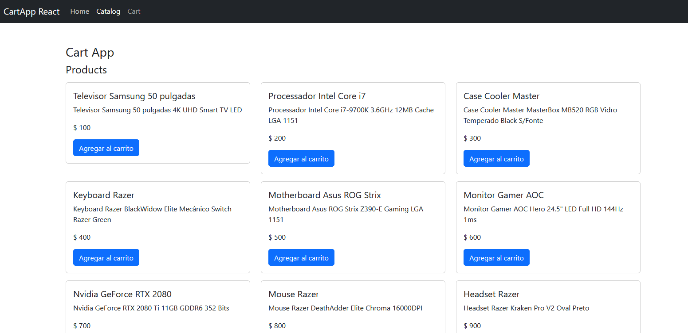
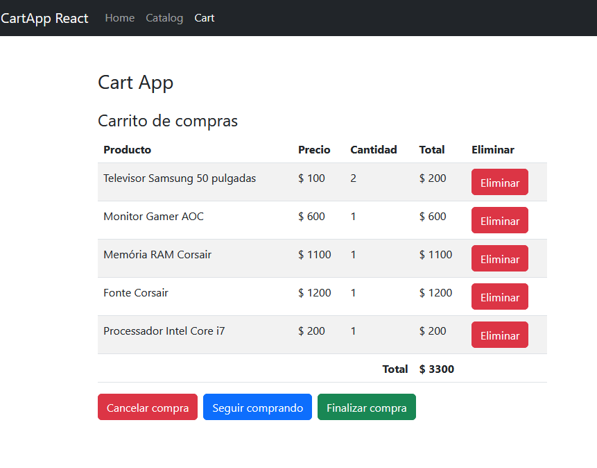
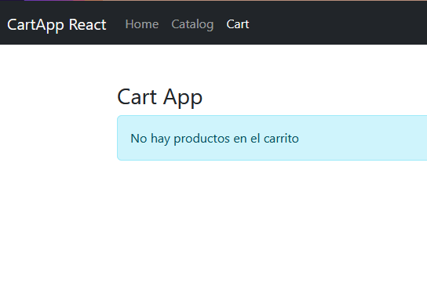
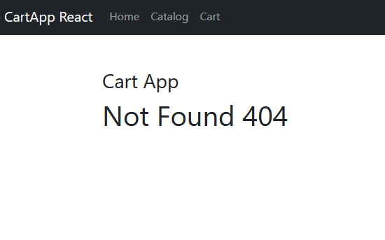

# Carrito de Compras en React 🛒

¡Bienvenido al Carrito de Compras en React! Este proyecto es una aplicación de práctica que utiliza tecnologías como React, hooks (useState, useEffect, useReducer, useNavigation, y custom hooks), React Router y datos ficticios. El objetivo futuro es conectarlo a una API real para obtener catálogos de productos y realizar pagos.

## Capturas de Pantalla 📸

¡Echa un vistazo a cómo luce la aplicación!

- **Página de inicio:**



- **Catálogo de Productos:**


- **Carrito de Compras:**





- **Confirmación de Compra:**




## Demo en Vivo 🚀

Puedes experimentar con la aplicación en tiempo real [aquí](https://cartapp-react.netlify.app). ¡Explora y simula compras!

## Cómo Clonar y Ejecutar 🚀

Sigue estos sencillos pasos para clonar y ejecutar el proyecto en tu máquina:

1. **Clona el Repositorio:**
   ```bash
   git clone https://github.com/bardolog1/cart-app-react.git
   ```
2. **Ingresa al Directorio del Proyecto:**
   ```bash
   cd carrito-de-compras
   ```   
3. **Instala las Dependencias:**
   ```bash
   npm install
   ```
4. **Inicia la Aplicación con Vite:**
   ```bash
   npm run dev
   ```

  ¡Listo! La aplicación estará disponible en tu navegador en [http://localhost:5174](http://localhost:5174).

## Contribución y Reporte de Errores 🤝

Si encuentras algún error o tienes ideas para mejorar esta aplicación, no dudes en abrir un problema o enviar una solicitud de extracción. ¡Estamos abiertos a colaboraciones!

## Futuras Características 🌟

Estas son algunas de las características planeadas para el futuro:
- Conexión a una API real para obtener datos de productos y procesar pagos.
- Mejora de la interfaz de usuario y experiencia de usuario.
- Integración con servicios de autenticación.
- Implementación de notificaciones y mensajes en tiempo real.

## Licencia 📝

Este proyecto está bajo la licencia MIT. Siéntete libre de usarlo como base para tus proyectos o contribuir a su desarrollo. Consulta el archivo [LICENSE](LICENSE) para obtener más información.

¡Esperamos que disfrutes explorando y mejorando el Carrito de Compras en React! Si tienes alguna pregunta, no dudes en contactarnos. ¡Felices compras! 🛍️🚀
    